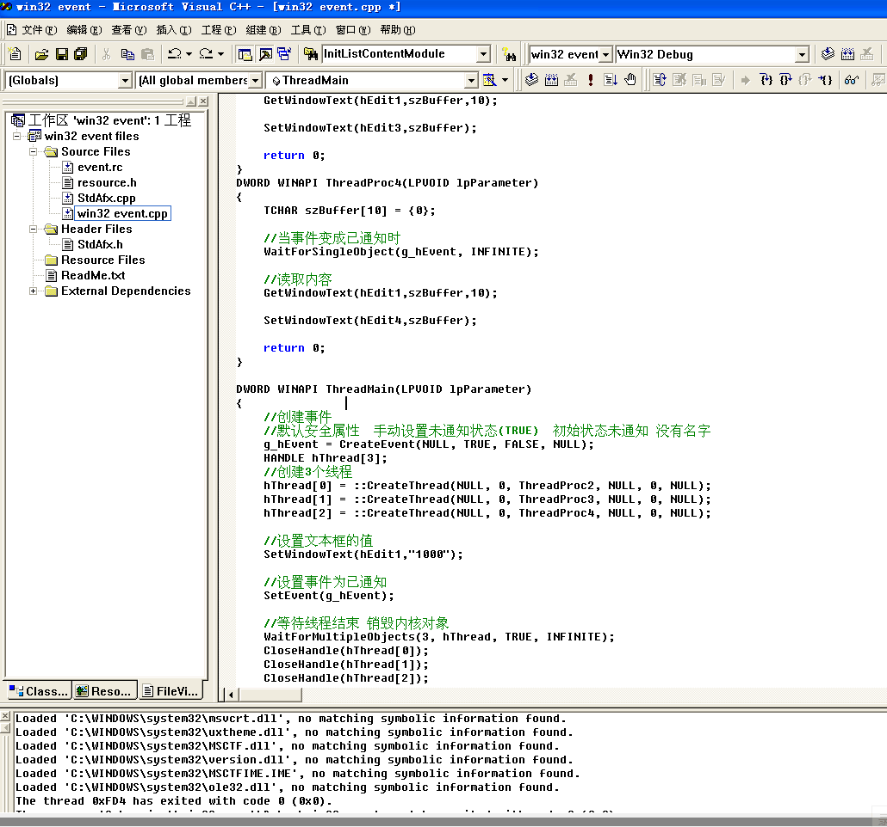
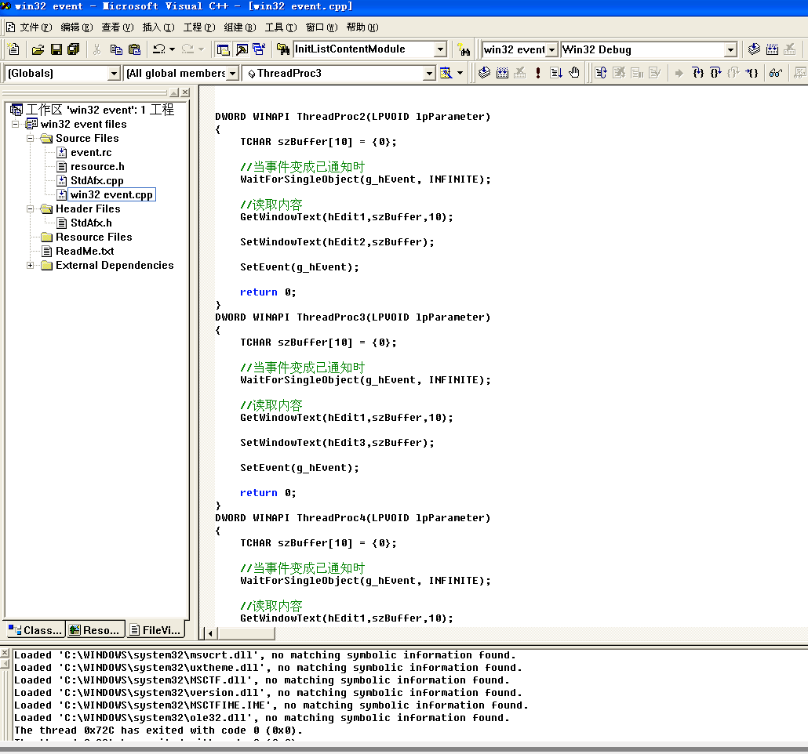
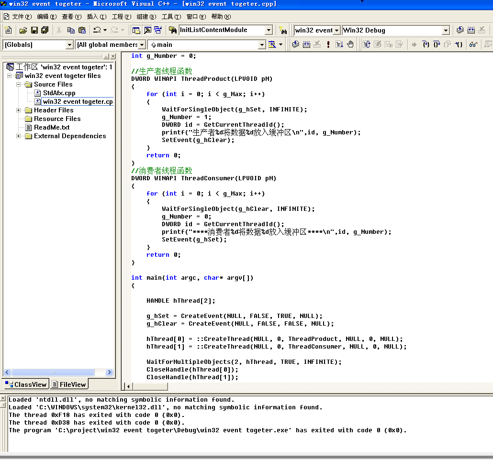

# 事件对象

编写一个程序，要求是创建一个线程并赋值给文本框，再创建另外三个线程同时取文本框里的值放到本线程的文本框内

有两种实现方法

1.`bInitialState`的值为TRUE，在子线程中使用`WaitForSingleObject(g_hEvent, INFINITE);`等待，在主线程中使用`SetEvent(g_hEvent);	`设置为已通知

实现效果如下

2.`bInitialState`的值为FALSE，在子线程中使用`WaitForSingleObject(g_hEvent, INFINITE);`等待，在操作完成即将退出子线程的时候使用`SetEvent(g_hEvent);`设置为已通知

实现效果如下

# 线程同步

要求两个线程同步执行且顺序交替

`bInitialState`设置为FALSE，默认为未通知状态，在每个线程要结束之前使用`SetEvent()`激活另外一个线程为已通知状态即可实现线程同步

实现结果如下

