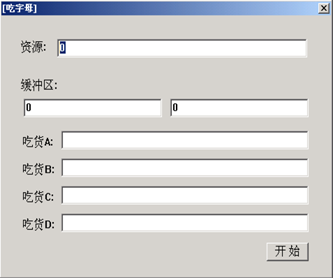
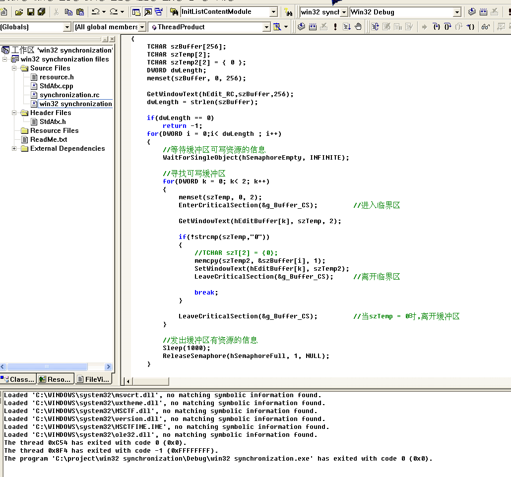
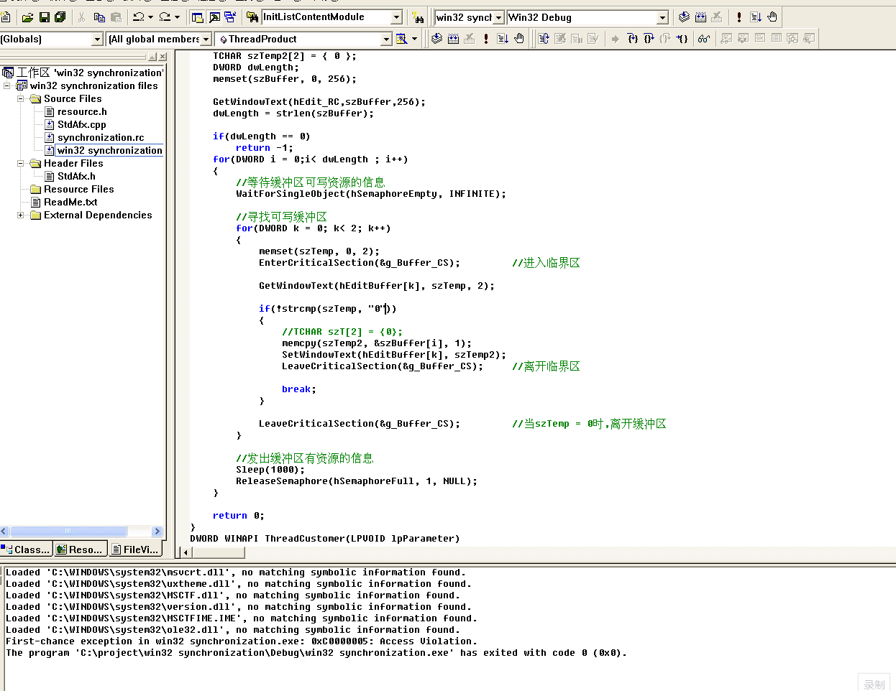
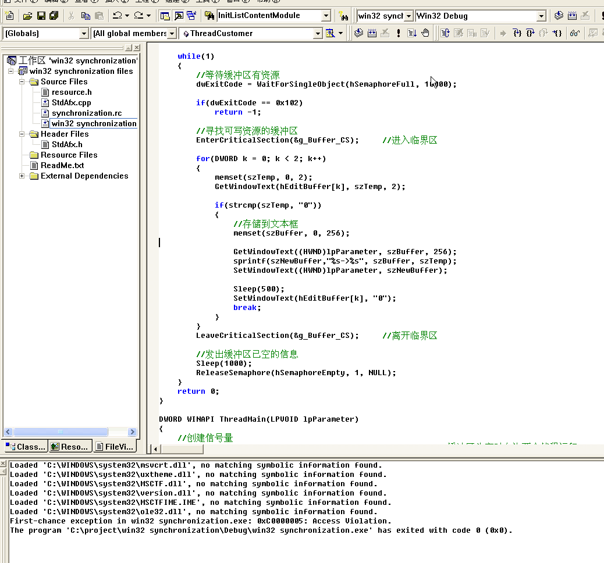

# 线程同步&线程互斥

demo.exe如图所示

功能描述：

1、在资源文本框输入任意个数量的字母，并点击开始按钮

2、线程P 逐个取出资源文本框中的字母，存储到下面缓冲区的文本框中

3、有四个C线程，从缓冲区中读取字母，读取后将缓冲区置"0",并讲读取的字母追加到自己的文本框中

## 大致思路

使用临界区/互斥体、信号量实现

创建1个主线程、4个子线程，主线程和子线程同步，5个线程分别互斥

主线程执行完成后使用`ReleaseSemaphore`发出信息让子线程执行，子线程执行完成后使用`ReleaseSemaphore`发出信息让主线程执行

## 踩的坑

1.注意进入和退出临界区的代码所放的位置，如果进入临界区的位置不对就会导致阻塞

2.注意`strcmp()`这个函数如果与0进行比较的时候一定要以字符串的形式存在，否则会报错`0xC0005`。因为两个函数里面都有这个`strcmp()`，导致报错`0xC0005`的时候单步去调花了很多时间

3.这里在把数据从缓冲区拿到下面的时候，注意这个地方需要使用到一个文本框数组用来存放，本意是在把数据从缓冲区拿走之后把缓冲区置0，这里如果直接使用`lpParameter`，就会导致下面的文本框置0

## 实现效果

这里在第一个缓冲区->第二个缓冲区的过程中加了一个`Sleep()`，所以第二个缓冲区往下读取的时候会比第一个缓冲区稍慢

