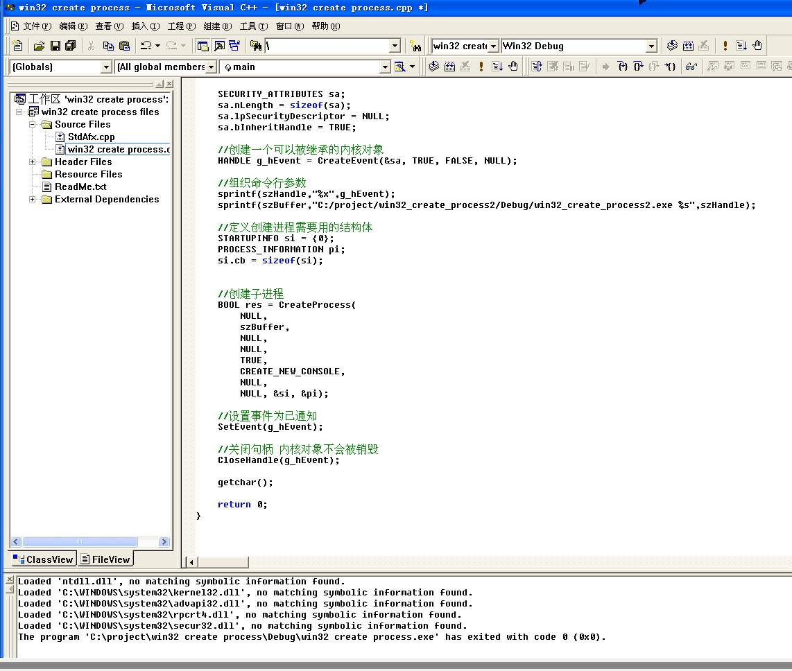

# 进程创建

使用`CreateProcess`，注意句柄继承必须使`bInheritHandles`的值置为TRUE

# 进程终止

有三种方法，一是利用`ExitProcess`终止自身进程，二是利用`TerminateProcess`终止其他进程，三是利用`ExitThread`终止所有线程

利用`GetExitCodeProcess()`获取进程退出码

# 句柄继承

前提`bInheritHandles`值为TRUE，继承句柄表里值为1的句柄

实现效果如下所示，在`SetEvent()`处断点，接收到消息后子进程才继续往下走

