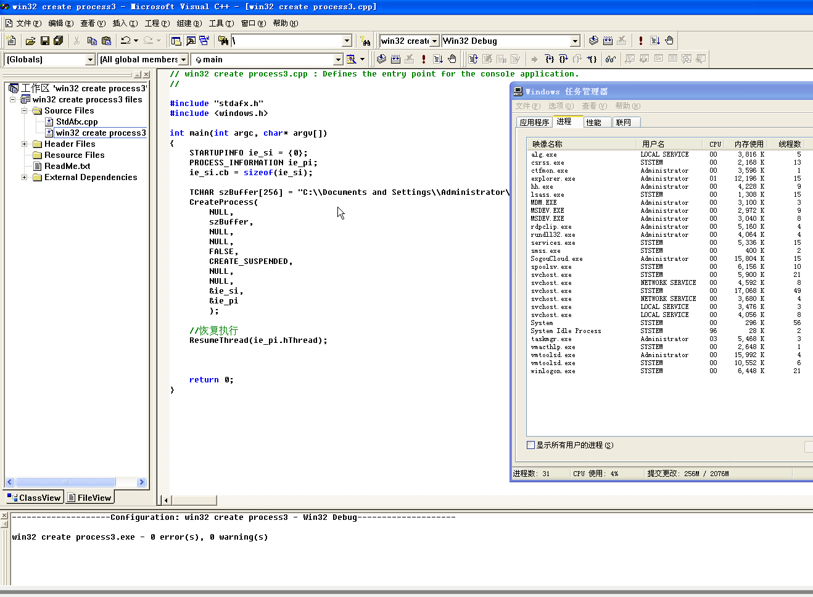
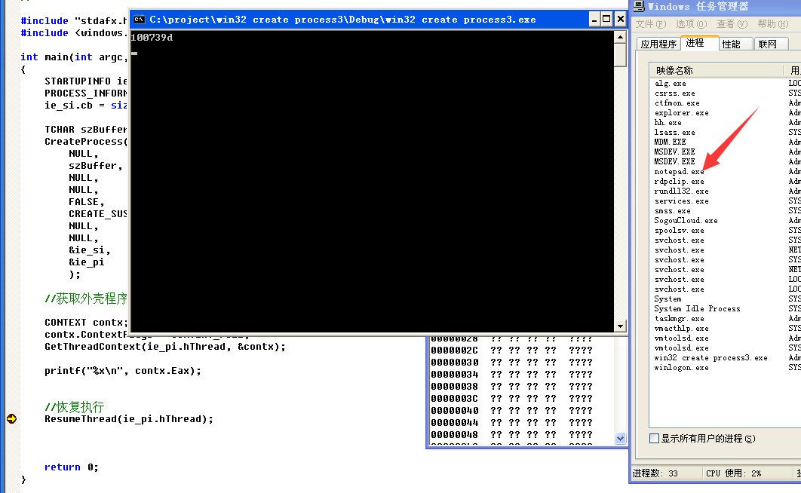

# 挂起模式启动进程

使用`CREATE_SUSPENDED`挂起进程，再使用`ResumeThread`恢复执行

## 获取ImageBase + OEP

使用到线程挂起时的`CONTEXT`结构，`ImageBase + OEP`存放在CONTEXT结构中的`Eax`寄存器里

## 获取ImageBase

读取其他进程用到`ReadProcessMemory`，`ImageBase`存放的地址为CONTEXT结构中的`Ebx + 8`

